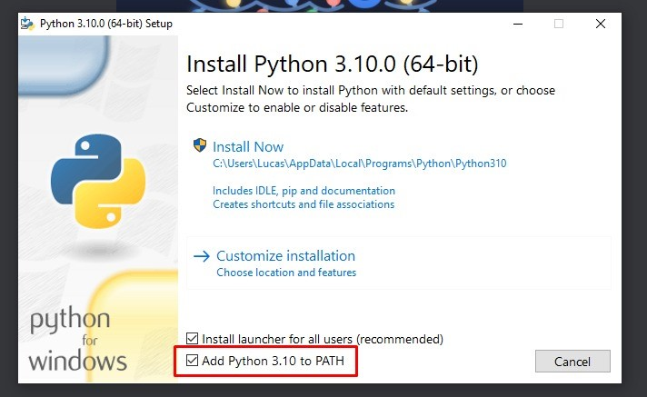

# Script Correção XML NFS-E


> O script foi criado para efetuar a correção de arredondamento do ISS, ISS retido e valor liquido nos XMLs enviados a ser convertidos em NFS-E para auxiliar no meu trabalho na Services 4 IT

## 💻 Pré-requisitos

Antes de começar, verifique se você atendeu aos seguintes requisitos:
<!---Estes são apenas requisitos de exemplo. Adicionar, duplicar ou remover conforme necessário--->
* Instalar o runtime do python no link: https://www.python.org/ftp/python/3.10.0/python-3.10.0-amd64.exe
* Selecionar a opção “Add Python 3.10 to PATH”
 


## 🚀 Instalando <script-correcao-xml-nfse>

Para instalar o <script-correcao-xml-nfse>, siga estas etapas:

Clonar o repositório com os comandos:

Link SSH:
```
git clone git@github.com:nordiws/script-correcao-xml-nfse.git
```

Link HTTP
```
git clone https://github.com/nordiws/script-correcao-xml-nfse.git
```

## ☕ Usando <script-correcao-xml-nfse>

Para usar <script-correcao-xml-nfse>, siga estas etapas:

```
Copiar os XMLs das notas a ser corrigidas na pasta ./erradas
Rodar o arquivo app.py
Copiar os XMLs das notas corrigidas da pasta ./corrigidas
```

### Ajustes e melhorias

O projeto ainda está em desenvolvimento e as próximas atualizações serão voltadas nas seguintes tarefas:

- [ ] Dar a opção de escolher as pastas de entrada e saída.
- [ ] Validar mais erros
- [ ] Criar uma interface para facilitar a utilização.


## 📫 Contribuindo para <script-correcao-xml-nfse>
<!---Se o seu README for longo ou se você tiver algum processo ou etapas específicas que deseja que os contribuidores sigam, considere a criação de um arquivo CONTRIBUTING.md separado--->
Para contribuir com <script-correcao-xml-nfse>, siga estas etapas:

1. Bifurque este repositório.
2. Crie um branch: `git checkout -b <nome_branch>`.
3. Faça suas alterações e confirme-as: `git commit -m '<mensagem_commit>'`
4. Envie para o branch original: `git push origin <script-correcao-xml-nfse> / <local>`
5. Crie a solicitação de pull.

Como alternativa, consulte a documentação do GitHub em [como criar uma solicitação pull](https://help.github.com/en/github/collaborating-with-issues-and-pull-requests/creating-a-pull-request).

## 🤝 Colaboradores

Agradecemos às seguintes pessoas que contribuíram para este projeto:

<table>
  <tr>
    <td align="center">
      <a href="#">
        <br>
        <sub>
          <b>Lucas / Criador da base do App</b>
        </sub>
      </a>
    </td>
</table>

## 📝 Licença

Esse projeto está sob licença. Veja o arquivo [LICENÇA](LICENSE.md) para mais detalhes.

[⬆ Voltar ao topo](#script-correcao-xml-nfse)<br>